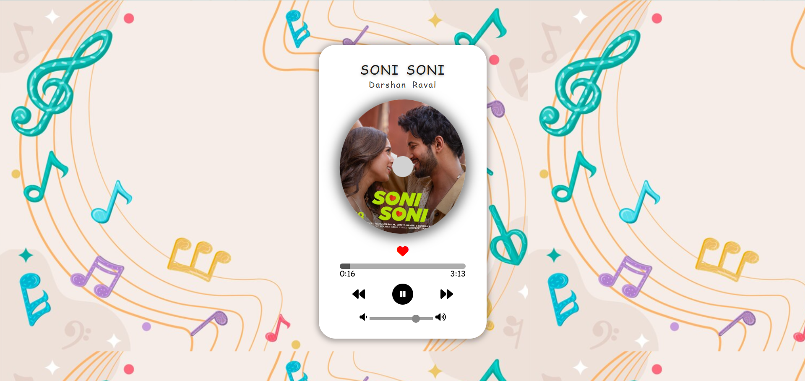

# Music Player

A beautiful and feature-rich music player built with HTML, CSS, and JavaScript that offers a seamless music listening experience with a modern UI.


*Music Player Interface with Album Art*

## Features

- 🎵 Play/Pause functionality
- ⏮️ Previous/Next track controls
- 🎚️ Volume control slider
- ⏩ Seek bar for track navigation
- ❤️ Like/Favorite button
- 🖼️ Dynamic album art display
- ⏱️ Real-time duration updates
- 🔄 Auto-play next track
- 📱 Responsive design

## Project Structure

```
music-player/
├── musicplayer.html    # Main application file
└── img/               # Assets directory
    ├── musicbg.png    # Background image
    ├── parth1.jpg     # Album art 1
    ├── parth1.mp3     # Song file 1
    ├── parth2.jpg     # Album art 2
    ├── parth2.mp3     # Song file 2
    ├── parth3.jpg     # Album art 3
    └── parth3.mp3     # Song file 3
```

## Technologies Used

- HTML5
- CSS3
- JavaScript
- Font Awesome Icons

## Setup

1. Clone the repository
```bash
git clone https://github.com/parthpatel8124/music-player.git
```

2. Navigate to project directory
```bash
cd music-player
```

3. Open `musicplayer.html` in a web browser

## Features in Detail

### Audio Controls
- Play/Pause toggle
- Skip to next/previous track
- Volume adjustment
- Track progress control

### UI Elements
- Circular album art display with rotation animation
- Current time and duration display
- Interactive seek bar
- Volume slider
- Like button with color animation

### Playlist Management
- Automatic track switching
- Circular playlist navigation
- Song information display (title & artist)

## Customization

To add new songs, update the songs array in the JavaScript:
```javascript
const songs = [
    {
        name: "filename",
        titlee: "Song Title",
        artist: "Artist Name"
    }
];
```

## CSS Features

- Smooth animations
- Gradient backgrounds
- Modern controls
- Responsive layout
- Shadow effects
- Hover states

## Browser Support

- Chrome
- Firefox
- Safari
- Edge
